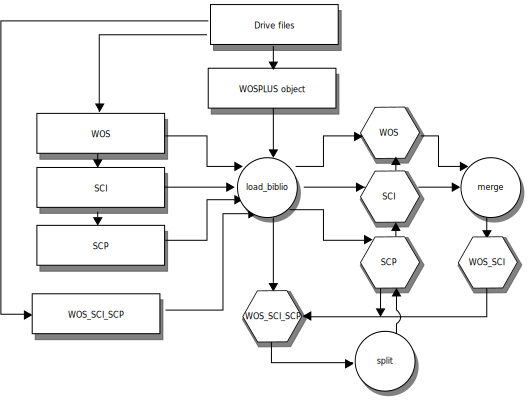

For WOSplus execution it is necessary to define drive.cfg file in which you specify the name of the file and the location of it. The drive.cfg file must be present in the execution folder. For example
``` bash
$cat drive.cfg
[FILES]
CIB_Scielo.xlsx                             = 0BxoOXsn2EUNIMldPUFlwNkdLOTQ
```
See also the drive.cfg file in the test folder which gives some addresses of the databases stored in google drive (password protected). If the file is not found there, it searched locally.


<!-- mv diagram to http://interactive.blockdiag.com and links as in https://github.com/jupyter/docker-stacks -->
# WOS+
## Visual Overview

